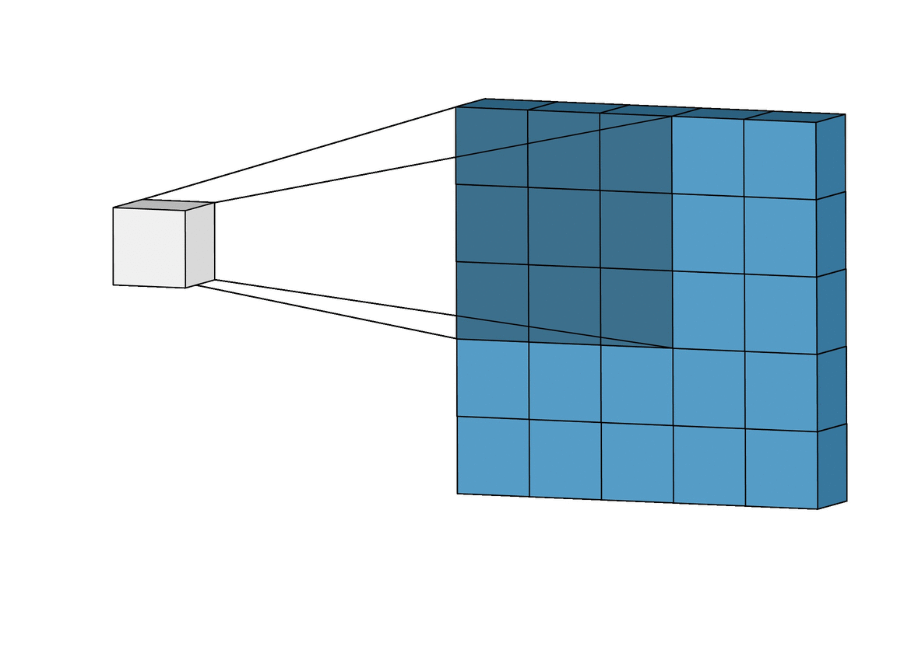

```{r setup, include=FALSE}
knitr::opts_chunk$set(echo = TRUE, warning = FALSE, message = FALSE, fig.align = 'center')
library(tidyverse)
library(EBImage)
library(png)
library(jpeg)
library(optimbase)
```


# Edge detection through convolutional operation

**In this presentation, I'll show how to get the edge image on the right with convolutional operation.**
```{r echo=FALSE, fig.align='default', fig.show='hold', out.width="30%"}
knitr::include_graphics(c("minions2.jpeg","edge_img_example.jpeg"))
```

**First of all, what is convolutional operation?**

Let's say we have a 6x6 matrix and a 3x3 filter. To perform convolutional operation, we would loop over the 6x6 matrix with our filter. For example, we'll first locate a 3x3 matrix on the 6x6 matrix, and we are going to get the sum of the element-wise products of the filter and the 3x3 matrix we located. We repeat this process until we looped through the entire matrix. 




**Let's see some simple edge detection examples in Python.**


[Jupyter notebook](https://github.com/XiaonaZhou/Edge_Detection_From_Scratch/blob/main/Simple_Edge_Detection_Demonstration_in_Python/Edge%20Detection%20demonstration%20.ipynb)


**Now, we know what convolutional operation is, let's get started on detecting the edges.**

## Steps needed for edge detection

1. Load image as an array with `readJPEG` or `readPNG`
2. Convert image to black and white
3. Pick a filter 
4. Apply convolutional operation with a nested for loop.


### Step 1: Load image

For **.jpeg** image,  load `library(jpeg)` and use `readJPEG("image_name")` to read image. 

For **.png** image, load `library(png)` and use `readPNG("image_name")` to read image. 

*Why use `readJPEG` and `readPNG`?*

It's faster. The main idea behind edge detection is to apply convolutional operation to the image with a filter (usually a 3x3 matrix). Images are read as arrays with these functions, which allows convolutional operation to be done more easily. 


```{r}
img <- readJPEG("minions2.jpeg")
class(img)
# dim() returns the height, width, number of color channel, respectively 
dim(img)
```

```{r}
original_image <- readImage("minions2.jpeg")
display(original_image, method = "raster")
```

### Step 2: Convert image to black and white

There are three methods for converting color to grayscale.

1. **lightness**: $\frac{\text{max}(R, G, B) + \text{min}(R, G, B)}{2}$

2. **average**: $\frac{R + G + B}{3}$

3. **luminosity**: $0.2126 R + 0.7152 G + 0.0722B$

I would use luminosity method for this example.

```{r}
# Get the dimension of the image and store it in dimension
dimension <- dim(img)

n <- dimension[1]
m <- dimension[2]
d <- dimension[3]
# bw_img is a copy of the original image
bw_img <- img

# loop over every pixel of the image with a nested for loop
for (row in 1:n){
  for (col in 1:m){
    bw_img[row,col,1:3] <- 0.2126*img[row,col,1]+
      0.7152*img[row,col,2]+0.0722*img[row,col,3]
  }
}

writeJPEG(bw_img, target ="bw_new.jpeg")

black_white <- readImage("bw_new.jpeg")
display(black_white, method = "raster")
```

Let's define a function `black_white` for converting image to black and white. The function takes in a 3D array image and return a 3D array balck and white image. 

```{r include=FALSE}
black_white <- function(img){
  # convert to black and white image
  dimension <- dim(img)
  n <- dimension[1]
  m <- dimension[2]
  
  # bw_img is a copy of the original image
  bw_img <- img

  # loop over every pixel of the image with a nested for loop
  for (row in 1:n){
    for (col in 1:m){
      bw_img[row,col,1:3] <- 0.2126*img[row,col,1]+
        0.7152*img[row,col,2]+0.0722*img[row,col,3]
    }
  }
  return(bw_img)
}
```

I also defined a function `display_mt` that takes an image in 3D array format and display it as image.

```{r include=FALSE}
# define a function that display matrix as image
display_mt <- function(mt){
  writeJPEG(mt, target ="temp.jpeg")
  edge_img <- readImage("temp.jpeg")
  display(edge_img, method = "raster")
}
```

Test out the two functions. 

```{r}
display_mt(black_white(img))
```


### Step 3: Pick a filter 

Some commonly used filters are listed below. The values in the filter can also be learned by machine for some complicated images. 

Note: There are vertical filter and horizontal filter. Horizontal filter is the transpose of the vertical filter. 

* Prewitt filter 

$$\begin{vmatrix}
1 & 0 & -1\\
1 & 0 & -1\\
1 & 0 & -1
\end{vmatrix}$$

* Sobel filter 

$$\begin{vmatrix}
1 & 0 & -1\\
2 & 0 & -2\\
1 & 0 & -1
\end{vmatrix}$$

* Scharr filter

$$\begin{vmatrix}
3 & 0 & -3\\
10 & 0 & -10\\
3 & 0 & -3
\end{vmatrix}$$


```{r}
# Sodel filter 
vertical_filter <- matrix(c(1,2,1, 0,0,0,-1,-2,-1),3,3)
horizontal_filter <- t(vertical_filter)
vertical_filter
horizontal_filter
```


### Step 4: Apply convolutional operation with a nested for loop.

Main idea:

* We loop over the whole image and locate a 3x3 matrix at each step
* In each step, we calculate the vertical and horizontal scores. The edge score equals to $\sqrt{\text{ver_score}^2+\text{hor_score}^2}$. Sometimes, formula $|\text{ver_score}|+|\text{hor_score}|$ is used as well. 

Let's demonstrate this computation. 

1. Locate a 3x3 matrix on the image
```{r}
local <- bw_img[1:3, 1:3,1]
local
```
2. compute the horizontal score 

```{r}
# apply convolution operator 
# that is get element-wise product  
horizontal_filter*local
```

Since the matrix we located have 1s everywhere, `horizontal_filter*local` gives back the horizontal filter. 

```{r}
# horizontal score is the sum of element-wise products
horiz_score <- sum(horizontal_filter*local)
horiz_score
```


3. compute the vertical score 

```{r}
verti_score <- sum(vertical_filter*local)
verti_score
```
4. Compute edge score.

Edge score is assignment back to the corresponding location, [1,1] in this case, as color value. 

```{r}
sqrt(verti_score^2+horiz_score^2)
```

Complete computation is shown below. 

```{r}
# create a copy of the original image to store edge scores 
edge_img <- img

#Loop over the image and compute edge scores
for (row in 1:(n-2)){
  for (col in 1:(m-2)){
    local <- bw_img[row:(row+2), col:(col+2),1]
    horiz_score <- sum(horizontal_filter*local)
    verti_score <- sum(vertical_filter*local)
    edge_img[row,col,1:3]<-sqrt(verti_score^2+horiz_score^2)
  }
}
# Colors are represented as values between 0 and 1 in R. 
# Divide all the values by max to ensure that all the values are between 0 and 1
edge_img <- edge_img/max(edge_img)
writeJPEG(edge_img, target ="edge_img.jpeg")
```

Let's check our final image.
```{r}
edge_img <- readImage("edge_img.jpeg")
display(edge_img, method = "raster")
```

I defined a function, `edge_detect`, that combine all the steps above. It takes three inputs, *image path*, *image format*, and *filter*, and returns the edge image as 3D array.

```{r include=FALSE}
# exit stops the function when the type is not jpeg or png
exit <- function() { invokeRestart("abort") }  

# Define edge_detection function
edge_detect <- function(image_name, type = c("jpeg", "png"),filter=c("Prewitt", "Sobel","Scharr")){
  
  # check the type of image 
  if (type == "jpeg"){
    img <- readJPEG(image_name)
  }else if (type == "png"){
    img <- readPNG(image_name)
  }
  else{
    print("Invalid image format")
    exit()
  }

  
  # convert to black and white image
  dimension <- dim(img)
  n <- dimension[1]
  m <- dimension[2]
  d <- dimension[3]
  # bw_img is a copy of the original image
  bw_img <- img

  # loop over every pixel of the image with a nested for loop
  for (row in 1:n){
    for (col in 1:m){
      bw_img[row,col,1:3] <- 0.2126*img[row,col,1]+
        0.7152*img[row,col,2]+0.0722*img[row,col,3]
    }
  }
  
  # define filters 
  if (filter == "Prewitt"){
    vertical_filter <- matrix(c(1,1,1, 0,0,0,-1,-1,-1),3,3)
    horizontal_filter <- t(vertical_filter)
  }else if (filter == "Sobel"){
    vertical_filter <- matrix(c(1,2,1, 0,0,0,-1,-2,-1),3,3)
    horizontal_filter <- t(vertical_filter)
  }else if (filter == "Scharr"){
    vertical_filter <- matrix(c(3,10,3, 0,0,0,-3,-10,-3),3,3)
    horizontal_filter <- t(vertical_filter)
  }else{
    if (class(filter) == c("matrix","array") & dim(filter)[1]==dim(filter)[2]){
      vertical_filter <- filter
      horizontal_filter <- t(vertical_filter)
    }
    else{
      print("Invalid filter")
      exit()
    }
    
  }
  
  #make filter size a variable for flexibility
  k <- dim(vertical_filter)[1]
  edge_img <- img
  for (row in 1:(n-k+1)){
    for (col in 1:(m-k+1)){
      local <- bw_img[row:(row+k-1), col:(col+k-1),1]
      horiz_score <- sum(horizontal_filter*local)
      verti_score <- sum(vertical_filter*local)
      edge_img[row,col,1:3]<-sqrt(verti_score^2+horiz_score^2)
    }
  }
  # Colors are represented as values between 0 and 1 in R. 
  # Divide all the values by max to ensure that all the values are between 0       and 1
  edge_img <- edge_img/max(edge_img)
  return(edge_img)
  # writeJPEG(edge_img, target ="edge_img.jpeg")
  # edge_img <- readImage("edge_img.jpeg")
  # display(edge_img, method = "raster")
  
}
```


Let's use this function and compare the three filters, **Prewitt**, **Sobel**, and **Scharr**. Below are the edge image resulting from the filters. 

```{r}
# Edge image with Prewitt filter
display_mt(edge_detect("minions2.jpeg", type = "jpeg", filter = "Prewitt"))

# Edge image with Sobel filter          
display_mt(edge_detect("minions2.jpeg", type = "jpeg", filter = "Sobel"))

# Edge image with Scharr filter 
display_mt(edge_detect("minions2.jpeg", type = "jpeg", filter = "Scharr"))
```

Comparing them side by side. 

```{r echo=FALSE, fig.align='default', fig.show='hold', out.width="33%"}
# writeJPEG(edge_detect("minions2.jpeg", type = "jpeg", filter = "Prewitt"), target ="prewitt_minions2.jpeg")
# writeJPEG(edge_detect("minions2.jpeg", type = "jpeg", filter = "Sobel"), target ="sobel_minions2.jpeg")
# writeJPEG(edge_detect("minions2.jpeg", type = "jpeg", filter = "Scharr"), target ="scharr_minions2.jpeg")
knitr::include_graphics(c("prewitt_minions2.jpeg","sobel_minions2.jpeg", "scharr_minions2.jpeg"))
```

I don't see much difference here with these three classic filters. What about other filters? 

You may have noticed that the three filters we used all had 0s as the middle column and the first and third columns are only different by a negative sign. I tested different filters and confirmed that as long as our filter possess this feature, it can detect edge quite well. 

Here are some examples: 

```{r warning=FALSE}
filter1 <- matrix(c(4,5,6,7, 0,0,0,0,0,0,0,0,-4,-5,-6,-7),4,4)
filter1

display_mt(edge_detect("minions2.jpeg", type = "jpeg", filter = filter1))
```


```{r warning=FALSE}
filter1 <- matrix(c(4,5,6,0,0,0,-5,-6,-7),3,3)
filter1

display_mt(edge_detect("minions2.jpeg", type = "jpeg", filter = filter1))
```


```{r warning=FALSE}
filter1 <- matrix(c(1,2,3,0,0,0,4,5,6),3,3)
filter1

display_mt(edge_detect("minions2.jpeg", type = "jpeg", filter = filter1))
```


Note: The method above did not do any padding (padding means adding 0s around the image). Due to the natural of mapping, we lost information on the edge of the image. Since most image has important information at the center, the lost is not significant for most cases. 

# Make improvements 

For a better result, I need to complete the following steps (Canny Edge Detection).

1. Noise Reduction: Apply Gaussian filter to smooth the image.

2. Apply filter (What I did above).

3. Non-maximum suppression:  The goal is to make thin edges. In this step, we go over every pixel in the image. If the pixel is the maximum along the edge direction, we keep the color value, otherwise, we set the value to 0.

4. Classify strong, weak, non-relevant pixels: In this step, we classify each pixel as strong, weak, or non-relevant. We change the color value of the pixel based its class.

5. Edge Tracking by Hysteresis: In this step, we will transform weak pixels into strong ones, if and only if the weak pixel is surrounded by at least one strong pixel. 

[reference](https://towardsdatascience.com/canny-edge-detection-step-by-step-in-python-computer-vision-b49c3a2d8123)

Improved edge image on the right. 

```{r echo=TRUE, fig.align='default', fig.show='hold', out.width="25%"}

knitr::include_graphics(c("sobel_minions2.jpeg", "improved_sobel_minions.jpeg"))
```

## 1. Noise Reduction

Gaussian filter is defined as 

$$g(x,y)=\frac{1}{2\pi\sigma^2}e^{-\frac{(x)^2+(y)^2}{2\sigma^2}}$$

To generate a Gaussian filter in R, we first define two matrices `X` and `Y` to represent the indexes of the values in the filter. 

Let's visualize `X` and `Y`

Note: the indexes are centered around zero instead of starting from 0. The reason is that the resulting image is too dark when starting from 0. 

```{r}
# a filter of size 5 
size <- 5
k <- size %/% 2
X <- matrix(rep(seq(-k,k),size),size,size)
Y <- t(X)
X
Y
plot(c(X),c(Y))
```

Define a function that generates Gaussian Filter. 

```{r}
 
Gaussian_filter <-function(size, sigma){
  k <- size %/% 2
  x <- matrix(rep(seq(-k,k),size),size,size)
  y <- t(x)
  gau_filter <- (1/(2*pi*sigma^2))*exp(-(x^2+y^2)/(2*sigma^2))
  return(gau_filter)
}
```


Test the `Gaussian_filter` function with size 5 and $\sigma = 1.4$.

```{r}
Gaussian_filter(5,1.4)
```


Before defining a function that applies convolutional operation with Gaussian filter, let's first understand padding and stride. 

Padding: adding values around the matrix. For edge detection problem, commonly used value is zero. Why use padding? For a $n \times n$matrix, the new dimension of the matrix of convolutional operation is defined as 

$$\lfloor \frac{n+2p-f}{s}+1 \rfloor$$ where $n$ is the dimension of the original matrix, $p$ is the layer of padding, $f$ is the filter size, and $s$ is the stride size. 
Stride: step size of the filter when applying convolutional operation. 

[Check this site for more detail on padding and stride](https://d2l.ai/chapter_convolutional-neural-networks/padding-and-strides.html)


### Zero padding in R

We are going to use `bdiag` function from *Matrix* package to add zeros around matrix. Even though the function was not built for the job, but it does exactly what we need here. 

In the example below, I created three matrices, a $4 \times 4 $ matrix `m` that needs to be padded by zeros, a $2 \times 2 $ matrix `top_left` that pads the top and left side of the matrix by zero, and a $2 \times 2 $ matrix `bottom_right` that take care of the padding on the bottom and right. 

```{r}
library(Matrix)
# 4x4 matrix contains only 3
m<-matrix(3,4,4)
# matrix(0, #layers of zero on the top, #layers of zero on the left)
top_left<-matrix(0,2,2)
# matrix(0, #layers of zero on the bottom, #layers of zero on the right)
bottom_right<-matrix(0,2,2)
paded <- bdiag(top_left,m,bottom_right)
paded
```

Let's define a function for zero padding

```{r}
zero_padding <- function(b_w_img, p){
  # number of color channel
  c <- dim(b_w_img)[3]
  # define the matrix for padding
  zero_pad <-matrix(0,p,p)
  # pad zero on the first color channel. 
  # for a black and white image, color values are the same across all color channel  
  paded_img <- bdiag(zero_pad,b_w_img[,,1],zero_pad)
  paded_img <- array(rep(paded_img ,c), dim = c(dim(paded_img)[1],dim(paded_img)[2],c))
  return(paded_img)
}
  
```

Test the function with 10 layers of zero-padding.

```{r}
display_mt(zero_padding(black_white(img),10))
```


For edge detection problem, we want to retain the dimension of the image and set stride equals to 1. That means we want 
$$\lfloor \frac{n+2p-f}{s}+1 \rfloor = n$$ 
Therefore, $p = \frac{f-1}{2}$.


Let's implement the function that applies convolutional operation with Gaussian filter. 

```{r echo=TRUE}

gaus_blur_ope <- function(img, filter){
  dimension <- dim(img)
  n <- dimension[1]
  m <- dimension[2]
  c <- dimension[3]
  
  # Zero padding 
  p <- (dim(filter)[1]-1)/2
  zero_pad <-matrix(0,p,p)
  paded_img <- bdiag(zero_pad,img[,,1],zero_pad)
  paded_img <- array(rep(paded_img ,c), dim = c(dim(paded_img)[1],dim(paded_img)[2],c))
  
  #make filter size a variable for flexibility
  k <- dim(filter)[1]
  
  # convolutional operation 
  for (row in 1:n){
    for (col in 1:m){
      local <- paded_img[row:(row+k-1), col:(col+k-1),1]
      img[row,col,1:c] <- sum(filter*local)

    }
  }
  return(img)
  
}

```

Let's test `gaus_blur_ope`.

```{r}
display_mt(gaus_blur_ope(black_white(img), Gaussian_filter(5,1.4)))
```


Comparing original image, black and white image, and smoothed image 


```{r echo=TRUE, fig.align='default', fig.show='hold', out.width="33%"}
# img <- readPNG("monarch_in_may.png")
# writeJPEG(black_white(img), target ="bw_monarch_in_may.jpeg")
# writeJPEG(gaus_blur_ope(black_white(img), Gaussian_filter(5,1.4)), target ="smoothed_monarch_in_may.jpeg")
knitr::include_graphics(c("monarch_in_may.png","bw_monarch_in_may.jpeg", "smoothed_monarch_in_may.jpeg"))
```


## 2. Apply filter

The `convolu_ope` function below is similar to the `edge_detect` function I defined for basic edge detection above. In this function, I also calculated the angle of the edge, which equals to $arctan(\frac{\text{hori_score}}{\text{-verti_score}})$). We'll use the angle values in the next step.  

```{r echo=TRUE}
exit <- function() { invokeRestart("abort") } 

convolu_ope <- function(img, filter=c("Prewitt", "Sobel","Scharr")){
  dimension <- dim(img)
  n <- dimension[1]
  m <- dimension[2]
  c <- dimension[3]
  
  # define filters 
  if (filter == "Prewitt"){
    vertical_filter <- matrix(c(1,1,1, 0,0,0,-1,-1,-1),3,3)
    horizontal_filter <- t(vertical_filter)
  }else if (filter == "Sobel"){
    vertical_filter <- matrix(c(1,2,1, 0,0,0,-1,-2,-1),3,3)
    horizontal_filter <- t(vertical_filter)
  }else if (filter == "Scharr"){
    vertical_filter <- matrix(c(3,10,3, 0,0,0,-3,-10,-3),3,3)
    horizontal_filter <- t(vertical_filter)
  }else{
    if (class(filter) == c("matrix","array") & dim(filter)[1]==dim(filter)[2]){
      vertical_filter <- filter
      horizontal_filter <- t(vertical_filter)
    }
    else{
      print("Invalid filter")
      exit()
    }
    
  }
  # Add a matrix that store slope theta = arctan(horiz_score/-vert_score)
  angle <- matrix(rep(1,n*m), n,m)
  
  #make filter size a variable for flexibility
  k <- dim(vertical_filter)[1]
  
  #Zero padding 
  p <- (dim(vertical_filter)[1]-1)/2
  zero_pad <-matrix(0,p,p)
  paded_img <- bdiag(zero_pad,img[,,1],zero_pad)
  paded_img <- array(rep(paded_img ,c), dim = c(dim(paded_img)[1],dim(paded_img)[2],c))
  
  # convolutional operation with a nested for loop
  for (row in 1:n){
    for (col in 1:m){
      local <- paded_img[row:(row+k-1), col:(col+k-1),1]
      horiz_score <- sum(horizontal_filter*local)
      verti_score <- sum(vertical_filter*local)
      img[row,col,1:c]<-sqrt(verti_score^2+horiz_score^2)
      angle[row,col] <- (atan2(horiz_score, -verti_score))*180/pi

    }
  }
  # Colors are represented as values between 0 and 1 in R. 
  # Divide all the values by max to ensure that all the values are between 0 and 1
  img <- img/max(img)
  result <- list("image" = img, "angle"  = angle)
  
}

```

Let's test this function. 

```{r}
smooth_img <- gaus_blur_ope(black_white(img), Gaussian_filter(5,1.4))
sobel_ope <- convolu_ope(smooth_img, "Sobel")
sobel_img <- sobel_ope$image
display_mt(sobel_img)
```


Let's see check the image after applying Sobel filter. 
```{r echo=TRUE, fig.align='default', fig.show='hold', out.width="50%"}
# img <- readPNG("monarch_in_may.png")
# smooth_img <- gaus_blur_ope(black_white(img), Gaussian_filter(5,1.4))
# sobel_ope <- convolu_ope(smooth_img, "Sobel")
# sobel_img <- sobel_ope$image
# writeJPEG(sobel_img, target ="sobel_monarch_in_may.jpeg")
knitr::include_graphics(c("smoothed_monarch_in_may.jpeg", "sobel_monarch_in_may.jpeg"))
```


## 3. Non-maximum suppression to make thin edges 

The goal of non-maximum suppression is to thin out the edges.

There are only two outcomes for each pixel.

1. We keep the value of the pixel when it is the maximum in the edge direction
2. We set the value to 0 when it is not the maximum. 

Each pixel in the image has a color value and angle value (we calculated the angle value along with the convolutional operation, it equals to $arctan(\frac{\text{hori_score}}{\text{-verti_score}})$)

Each pixel is surrounded by other 8 pixels. The pixel at the center is compared with the other two pixels. Which two? It depends on the angle of the pixel. See below. 


```{r}
Non_max_suppre <- function(img, angle){
  new_img <- array(rep(0,dim(img)[1]* dim(img)[2]*dim(img)[3]), dim = c(dim(img)[1], dim(img)[2], dim(img)[3]))
  angle[angle<0] <- angle[angle<0]+180
  for ( row in 2:(dim(img)[1]-1)){
    for (col in 2:(dim(img)[2]-1)){
      q <- 1
      r <- 1
      # angle 0
      if ((0 <= angle[row,col] &  angle[row,col]< 22.5) || (157.5 <= angle[row,col] & angle[row,col] <= 180)){
        q <- img[row, (col+1),1]
        r <- img[row, (col-1),1]
        if ((img[row, col,1] >= q )& (img[row, col,1] >= r)){
        new_img[row,col,1:3] <- img[row, col,1]
        }else{
          new_img[row,col,1:3] <- 0
          }
        # angle 45
      }else if ((22.5 <= angle[row,col]) & (angle[row,col] < 67.5)){
        q <- img[(row+1), (col-1),1]
        r <- img[(row-1), (col+1),1]
        if ((img[row, col,1] >= q )& (img[row, col,1] >= r)){
        new_img[row,col,1:3] <- img[row, col,1]
        }else{
          new_img[row,col,1:3] <- 0
          }
        # angle 90
      }else if ((67.5 <= angle[row,col]) & (angle[row,col] < 112.5)){
        q <- img[(row+1), col,1]
        r <- img[(row-1), col,1]
        if ((img[row, col,1] >= q )& (img[row, col,1] >= r)){
        new_img[row,col,1:3] <- img[row, col,1]
        }else{
          new_img[row,col,1:3] <- 0
          }
        # angle 135
      }else if ((112.5 <= angle[row,col]) & (angle[row,col] < 157.5)){
        q <- img[(row-1), (col-1),1]
        r <- img[(row+1), (col+1),1]
        if ((img[row, col,1] >= q )& (img[row, col,1] >= r)){
        new_img[row,col,1:3] <- img[row, col,1]
        }else{
          new_img[row,col,1:3] <- 0
          }
      }

       
    }
  }
  return(new_img/max(new_img))
}
```

Let's test out the function. 

```{r}
smooth_img <- gaus_blur_ope(black_white(img), Gaussian_filter(5,1.4))
sobel_ope <- convolu_ope(smooth_img, "Sobel")
sobel_img <- sobel_ope$image
sobel_ang <- sobel_ope$angle
Non_max_img <- Non_max_suppre(sobel_img, sobel_ang)
display_mt(Non_max_img)
```


Below are images before and after non-max suppression(on the right).

```{r echo=TRUE, fig.align='default', fig.show='hold', out.width="50%"}
# img <- readPNG("monarch_in_may.png")
# smooth_img <- gaus_blur_ope(black_white(img), Gaussian_filter(5,1.4))
# sobel_ope <- convolu_ope(smooth_img, "Sobel")
# sobel_img <- sobel_ope$image
# sobel_ang <- sobel_ope$angle
# Non_max_img <- Non_max_suppre(sobel_img, sobel_ang)
# writeJPEG(Non_max_img, target ="non_max_monarch_in_may.jpeg")
knitr::include_graphics(c("sobel_monarch_in_may.jpeg", "non_max_monarch_in_may.jpeg"))
```

## 4. Classify strong, weak, non-relevant pixels 

In this step, we first identify each pixels as strong, weak, or non-relevant. Next, we reset color values based on the classes. 

A pixel is classified as 

* strong when the color value is higher than high threshold 
* weak when the color value between high and low threshold 
* non-relevant when the color value is lower than low threshold 

```{r}
iden_str_weak <- function(img, weak_pix = 0.3, strong_pixel = 1, low = 0.05, high = 0.15){
  # define high color value based on high threshold value
  high <- max(img)*high
  # define low color value
  low <- high * low
  # get the dimension of the image
  n <- dim(img)[1]
  m <- dim(img)[2]
  # create a copy of the image 
  str_weak_img <- img 
  # get the index of strong pixels 
  strong_index <- which((img>=high), arr.ind = T)
  # reset color values of strong pixels
  str_weak_img[strong_index] <- strong_pixel
  # get the index of weak pixels 
  weak_index <- which((img<=high&img>=low), arr.ind = T)
  # reset color values of weak pixels
  str_weak_img[weak_index] <- weak_pix
  # get the index of non-relevant pixels 
  non_re_index <-  which((img<low), arr.ind = T)
  # reset color values of non-relevant pixels
  str_weak_img[non_re_index] <- 0
  return(str_weak_img)
}
```


Let's test out this function. 

```{r}
display_mt(iden_str_weak(Non_max_img))
```

Below are images before and after resetting color values based on the classes(on the right).

```{r echo=FALSE, fig.align='default', fig.show='hold', out.width="50%"}
# img <- readPNG("monarch_in_may.png")
# smooth_img <- gaus_blur_ope(black_white(img), Gaussian_filter(5,1.4))
# sobel_ope <- convolu_ope(smooth_img, "Sobel")
# sobel_img <- sobel_ope$image
# sobel_ang <- sobel_ope$angle
# Non_max_img <- Non_max_suppre(sobel_img, sobel_ang)
# str_weak <- iden_str_weak(Non_max_img,weak_pix = 0.3, low = 0.09, high = 0.17)
# writeJPEG(str_weak, target ="str_weak_monarch_in_may.jpeg")
knitr::include_graphics(c("non_max_monarch_in_may.jpeg", "str_weak_monarch_in_may.jpeg"))
```


## 5. Edge Tracking by Hysteresis 

In this step, we will transform weak pixels into strong ones, if and only if the weak pixel is surrounded by a strong pixel. 


```{r}
hysteresis <- function(img, weak = 0.3, strong = 1 ){
  n <- dim(img)[1]
  m <- dim(img)[2]
  # loop through every pixel with a nested for loop 
  for (row in 2:(n-1)){
    for (col in 2:(m-1)){
      # if a weak pixel is found 
      if (img[row,col,1]==weak){
        # check whether it is surronded by at least one strong pixel
        if (img[(row+1),(col-1),1]==strong || img[(row+1),col,1]==strong || img[(row+1),(col+1),1]==strong || img[row,(col-1),1]==strong || img[row,(col+1),1]==strong || img[(row-1),(col-1),1]==strong || img[(row-1),col,1]==strong || img[(row-1),(col+1),1]==strong || img[row,col,1]==strong){
          # set the color value to strong
          img[row,col, 1:3] <- strong
        }else{
          # set the color value to zero (black)
          img[row,col,1:3] <- 0
        }
      } 
    }
  }
  return(img)
}
```

Let's test this function.

```{r}
display_mt(hysteresis(iden_str_weak(Non_max_img)))
```


Comparison of images from *Step 3*, *Step 4*, *Step 5*. 

```{r echo=FALSE, fig.align='default', fig.show='hold', out.width="33%"}
# img <- readPNG("monarch_in_may.png")
# smooth_img <- gaus_blur_ope(black_white(img), Gaussian_filter(5,1.4))
# sobel_ope <- convolu_ope(smooth_img, "Sobel")
# sobel_img <- sobel_ope$image
# sobel_ang <- sobel_ope$angle
# Non_max_img <- Non_max_suppre(sobel_img, sobel_ang)
# str_weak <- iden_str_weak(Non_max_img,weak_pix = 0.3, low = 0.09, high = 0.17)
# final <- hysteresis(str_weak, weak = 0.3)
# writeJPEG(final, target ="final_monarch_in_may.jpeg")
knitr::include_graphics(c("non_max_monarch_in_may.jpeg", "str_weak_monarch_in_may.jpeg", "final_monarch_in_may.jpeg"))
```


Finally, I defined a function `edge_detection` that does all the five steps together. 

```{r}
edge_detection <- function(img, filter, gau_blur_size = 5, gau_sigma = 1.4, weak_pix = 0.4, lowthreshold = 0.09,highthreshold = 0.17){
  smooth_img <-gaus_blur_ope(black_white(img), Gaussian_filter(5,1.4))
  result <- convolu_ope(smooth_img, filter)
  image <- result$image
  angle <- result$angle
  #display_mt(hysteresis(iden_str_weak(Non_max_suppre(image, angle), weak_pix = weak_pix , low =lowthreshold ,high = highthreshold), weak = weak_pix))
  return(hysteresis(iden_str_weak(Non_max_suppre(image, angle), weak_pix = weak_pix , low =lowthreshold ,high = highthreshold), weak = weak_pix))
}

```
Below are the original image and edge images filter by three different filters, Prewitt, Sobel, and Scharr (from left to right, respectively)


```{r echo=FALSE, fig.align='default', fig.show='hold', out.width="25%"}
# face_img <- readPNG("face_img.png")
# writeJPEG(edge_detection(face_img, filter ="Sobel"), target ="sobel_face.jpeg")
# writeJPEG(edge_detection(face_img, filter ="Prewitt"), target ="prewitt_face.jpeg")
# writeJPEG(edge_detection(face_img, filter ="Scharr"), target ="scharr_face.jpeg")

knitr::include_graphics(c("face_img.png","prewitt_face.jpeg", "sobel_face.jpeg", "scharr_face.jpeg"))
```


There's no/little difference between these edge images again. 

Let's try some other filters.  
```{r warning=FALSE}
img <- readPNG("monarch_in_may.png")
filter1 <- matrix(c(1,1,1, 1,1,0,1,0,0),3,3)
filter1
display_mt(edge_detection(img, filter =filter1))
```


```{r warning=FALSE}
filter2 <- matrix(c(1,2,3, 0,0,0,-4,-5,-6),3,3)
filter2
display_mt(edge_detection(img, filter =filter2))
```

```{r warning=FALSE}
filter3 <- matrix(c(10,20,30 ,0,0,0,-10,-20,-30),3,3)
filter3
display_mt(edge_detection(img, filter =filter3))
```


# So, how does edge detection related to convolutional neural network?

Below is a simple convolutional neural network diagram shows the basic structure: convolutional layer followed by max pooling layer, and another convolutional layer and max pooling layer, and a fully-connected layer. To get the convolutional layer, we would be doing the same thing as we did for edge detection. 


```{r eval=FALSE, include=FALSE}
#[brilliant.org](https://brilliant.org/wiki/convolutional-neural-network/)
```


